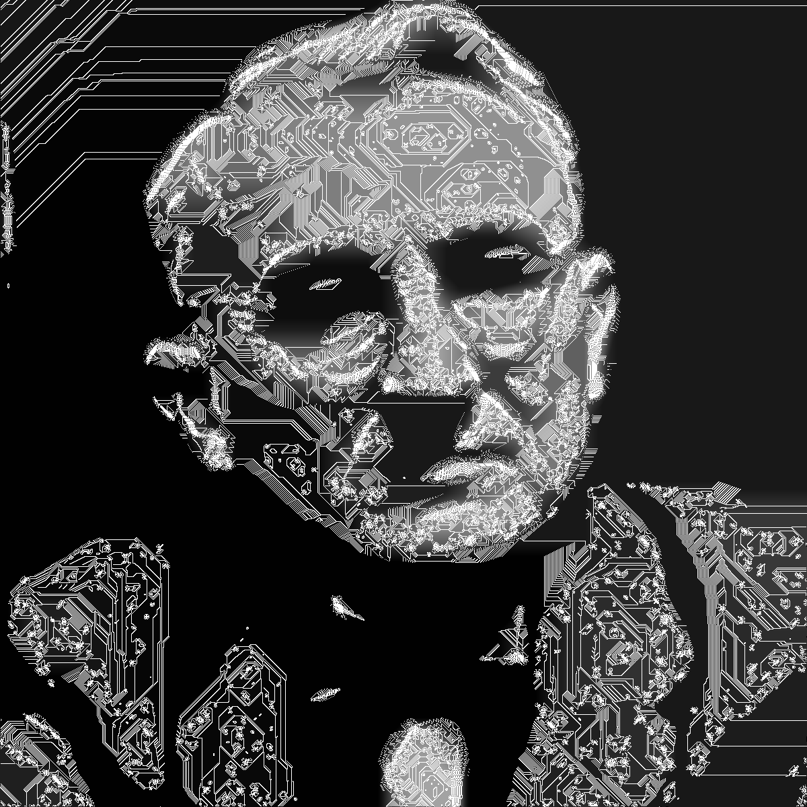

# bad-image-processor
My experiments with image processing

To use compile and run with two filename arguments - first is target to open, second to create/overwrite. Works only with png's

For interesting results, uncomment lines labeled with 'remove for interesting results' and tweak values. An example:
-----

